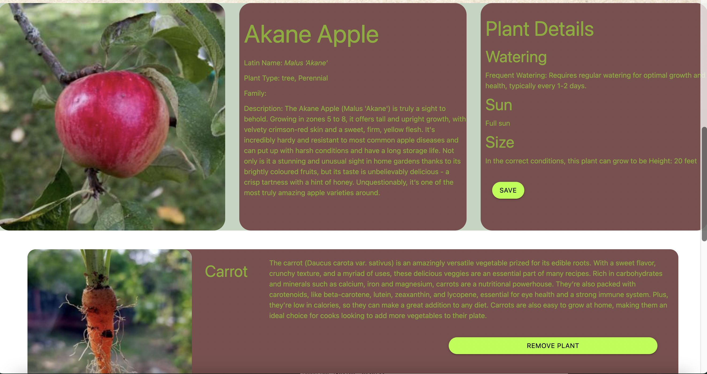

# All About Plants!
Plant info project using server-side APIs to give information to the user

## Description
All About Plants allows you to search for plants and learn about how to care for them. You can save your plants to the Garden Pal app if you want to revisit them later. 

This project is a practice in calling and manipulating data from an API, and dynamically creating elements on our webpage using JavaScript, based on what the user searches. 

This application uses two APIs from perenual.com. One is a database with over 10,000 plants, all with different searchable parameters. We allow our user to search for the common name of the plant they want to learn more about. 
The second API contains a description, watering, sun, and size details. We then display these details after the user selects a plant. 

### User Story 
“As a gardener, I would like to be able to search for different plants, and learn about how I can take care of them.”

## Screenshot

## Link
[Click here to view the project!](https://nicklearning.github.io/plant-info-project/)

## Credits
Created by Team Zen
Nick Smith, Anthony Castilo, Jacob Brown, Jesse Bradbury

Thank you to Perannual for their awesome API. 
[https://perenual.com](https://perenual.com)

Materialize is used as the UI Framework 
[https://materializecss.com](https://materializecss.com)

