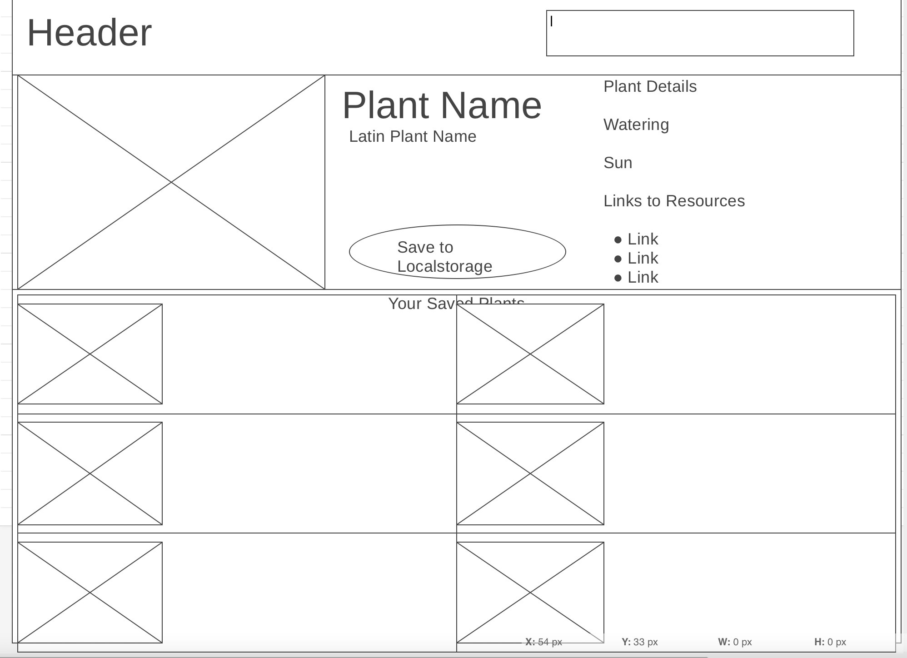

# plant-info-project
Plant info project using server-side APIs to give information to the user

# Day 1 Project Checklist

## Project Title: 
Plant Info App

## Project description: 
An app where you can search for plants, then be presented with gardening tips and pictures and resources. 

## User story:
As a gardener I would like to more about growing different plants, and how I can take care of them. 

## Wireframe :

## APIs to be used
Perenual
https://perenual.com/docs/api

Wikipedia - Provide  links using query selectors

USDA Plant Database
https://rapidapi.com/tuvshno/api/plants10/details
https://plants-api-docs.netlify.app/#tag/rarity/paths/~1plants~1rarity/get

Trefle
https://docs.trefle.io/docs/guides/getting-started#rate-limiting

## Additional features for adding another API
Use Google maps to show user a location for a nearby nursery/plant store

## UI Frameworks other than Bootstrap. 

Bulma
https://bulma.io

Materialize
https://materializecss.com

## Rough Breakdown of tasks and who will receive those tasks.
Done in Trello